# fit4uni-project-overview
Overview of my SCC201 Software Engineering group project
# Fit4Uni App — Software Engineering Group Project

Fit4Uni is a mobile fitness application designed for Lancaster University students. The app encourages students to stay active by combining fitness tracking, gamification, rewards, social challenges, leaderboards, and an AI assistant.

This repository is a public overview of my SCC201 Software Engineering group project. The full source code is stored in a private Lancaster University GitLab repository because it was a group university project.

## Project Type

University group project for SCC201 Software Engineering Design Studio.

## Tech Stack

* React Native / Expo
* JavaScript
* Supabase
* GitLab
* Figma / UI design tools

## My Contribution

* Contributed to the front-end development of the mobile application.
* Worked on user interface screens, navigation, and app layout improvements.
* Helped with system architecture, requirements analysis, and project documentation.
* Used GitLab for version control, branching, commits, and team collaboration.
* Participated in planning, implementation, testing, and the final project demo.

## Key Features

* Sign up and login flow
* Gamified campus map with challenge nodes
* Workout check-in and camera/photo verification option
* Progress tracking and streaks
* Avatar rewards and locked future rewards
* Dash AI assistant for workout and student meal suggestions
* Weekly, monthly, and all-time leaderboard
* Friend search and social quests
* Profile dashboard
* Accessibility and language settings

## Screenshots

### Sign Up

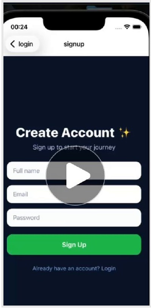

### Login

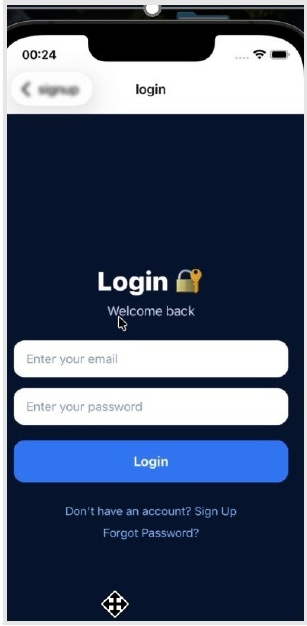

### Campus Map

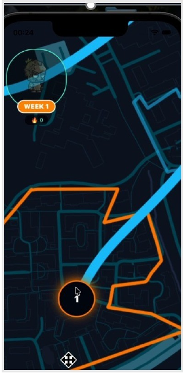

### Workout Check-In

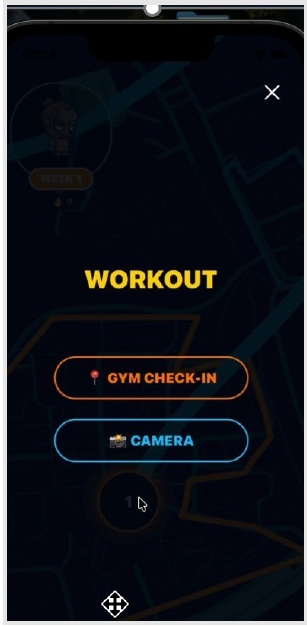

### Progress Map

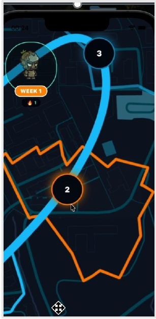

### Avatar Reward

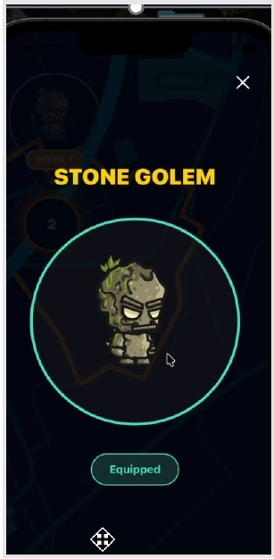

### Dash AI Assistant

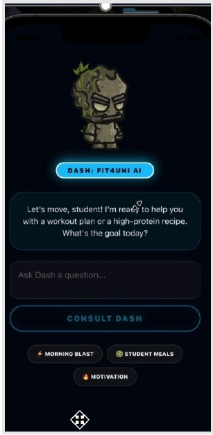

### Leaderboard

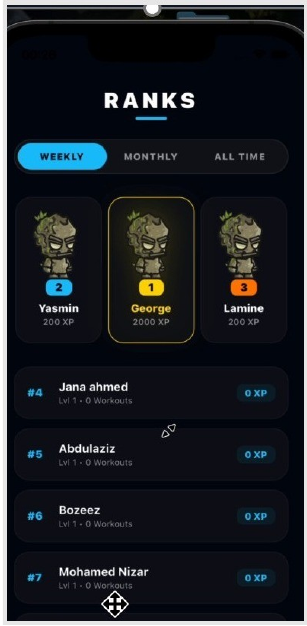

### Social Quests

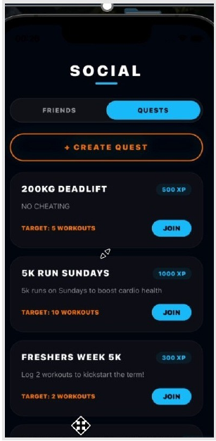

### Profile

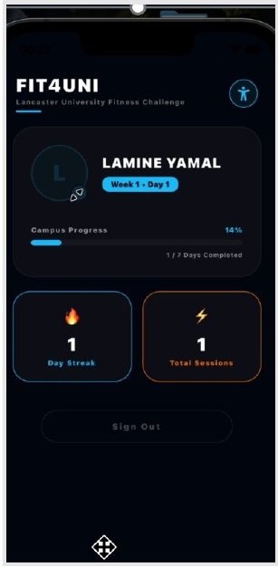

### Accessibility Settings

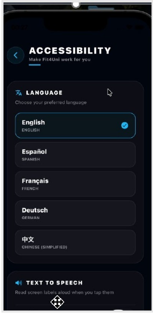

